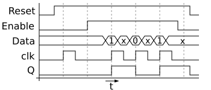

> Ein Experte ist jemand, der auf einem sehr begrenzten Fachgebiet
> bereits alle denkbaren Fehler gemacht hat.
>
> — *Niels Bohr*
{.epigraph}

Diese Notiz beschreibt den Aufbau der Datenübertragung zwischen
Messmodul und Steuergerät des *µMezura-8*. Ziel ist eine robuste,
taktsynchrone Kommunikation über einfache Zweidrahtleitung.[^1]

## Prinzipielle Struktur

Die Übertragung erfolgt seriell nach folgendem Ablauf:

```text
SYNC → HEADER → PAYLOAD → CRC16 → IDLE
```

## Signaltheorie

Ein analoges Signal $x(t)$ wird periodisch abgetastet.
Gemäß dem *Nyquist-Shannon-Theorem* gilt:

$$
f_\mathrm{s} \ge 2 f_\mathrm{max}
$$

Für die Filterung vor der Digitalisierung verwenden wir einen
Tiefpass mit dem Frequenzgang

$$
H(j\omega) = \frac{1}{1 + j\omega RC}
$$

## Implementierung
Jeder Frame beginnt mit einem 16-Bit-Sync-Wort (0xAA55), gefolgt von
Längenangabe und Nutzdaten. Zur Fehlererkennung dient eine
CRC-16-Checksumme nach IBM-Polynom.[^2]



**Implementierungshinweis** In der Firmware wird die Zustandsmaschine in C implementiert. Für die
Desktop-Simulation existiert ein Rust-Prototyp, der Byte-Strom in
Ereignisse übersetzt:

```rust
for b in stream {
    if parser.feed(b)? == Frame::Complete {
        println!("Frame empfangen: {:?}", parser.frame());
    }
}
```

Der Parser nutzt ringpufferbasierten Empfang, um auch bei
unvollständigen Frames korrekt zu resynchronisieren.

**Anmerkung zur physikalischen Schicht** Die Leitung ist für Übertragungsraten bis 115 200 baud ausgelegt. Bei
längeren Kabellängen (> 2 m) treten Reflexionen auf. Eine RS-485-Treiberstufe
wird derzeit entwickelt.

## Messwerte der Signalübertragung

| Parameter        | Symbol | Wert       | Einheit |
|------------------|:------:|-----------:|:--------|
| Abtastrate       | $f_s$  | 10 000     | Hz      |
| Grenzfrequenz    | $f_c$  | 1 000      | Hz      |
| Verstärkung      | $A_v$  | 2.5        | —       |
| Phasenverschiebung | $\varphi$ | −12.3 | °       |
| Versorgungsspannung | $U_\mathrm{B}$ | 3.3 | V |


[^1]: „Zweidrahtleitung“ bedeutet hier eine verdrillte symmetrische Verbindung ohne Bezug zu Masse.
[^2]: Polynom: $x^{16} + x^{15} + x^2 + 1$; siehe Dokument CRC-Spec v1.2.
